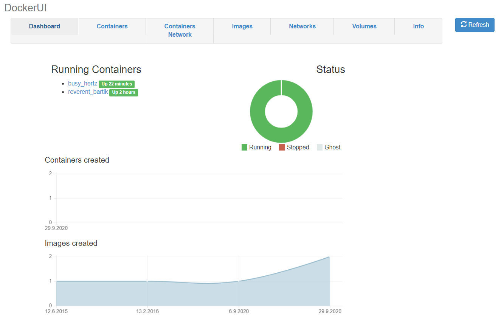
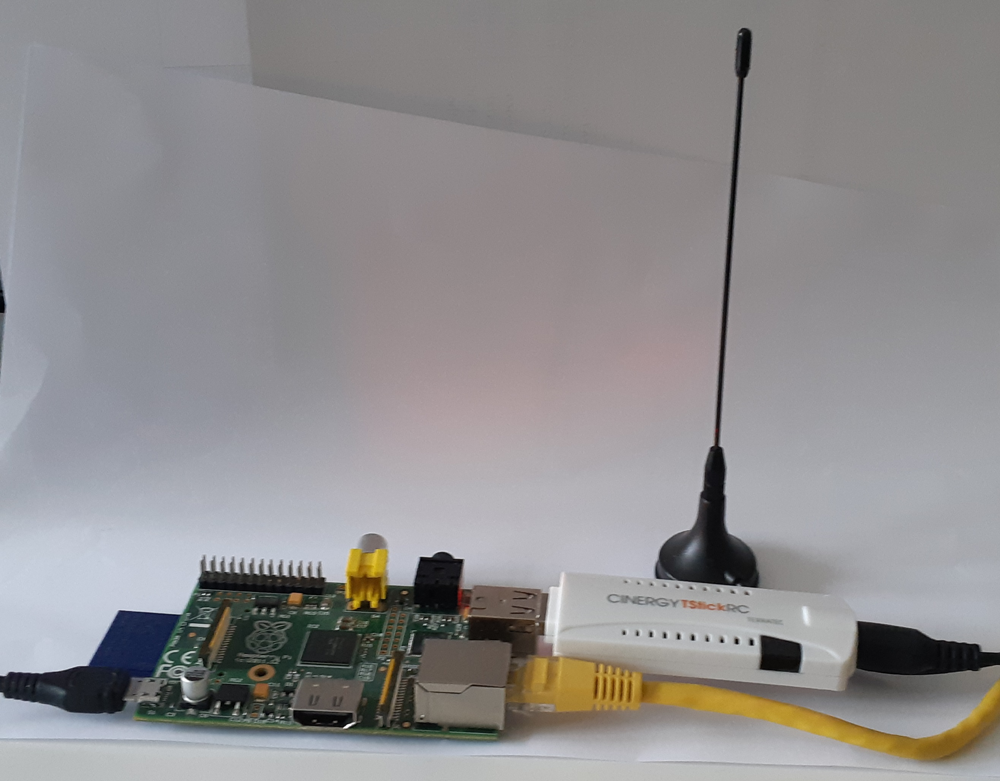
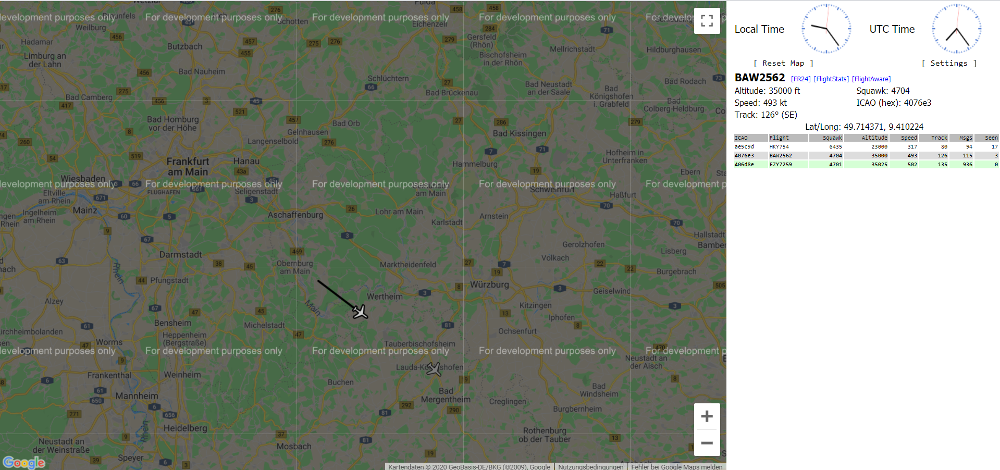

# raspberry-pi-examples
raspberry-pi docker examples

## Install Hypriot Docker on Image 
https://blog.hypriot.com/getting-started-with-docker-and-windows-on-the-raspberry-pi/

## Helpfull docker images

- Docker UI
```
 docker run -d -p 9000:9000 -v /var/run/docker.sock:/var/run/docker.sock hypriot/rpi-dockerui
```

### Run a web browser on port 9000



- Debian with Java
```
docker run --rm -it raspberry-pi-debian-openjdk:8-stretch bash
```


# Connect arduino with raspberry

## Install Test-Software on Arduino
- Use File connect-arduino/serial/serial.ino

## Start
```
 stty 9600 -F /dev/ttyACM0 raw -echo
 docker run --rm -it --device /dev/ttyACM0:/dev/ttyACM0 balenalib/raspberry-pi-debian-openjdk:8-stretch bash
```

```
> install_packages git
> git clone https://github.com/dfriedenberger/raspberry-pi-examples.git
> cd raspberry-pi-examples/connect-arduino
> javac Connect.java
> java Connect
```

# Play Sound

## Start
```
 docker run --rm -it --device /dev/vchiq:/dev/vchiq balenalib/raspberry-pi-debian-openjdk:8-stretch bash
```

```
    install_packages omxplayer wget
    wget https://file-examples-com.github.io/uploads/2017/11/file_example_WAV_1MG.wav
    omxplayer -o local file_example_WAV_1MG.wav
    omxplayer -o hdmi file_example_WAV_1MG.wav
```

# Flight radar - receive ADS-B Records from airplanes 
https://mode-s.org/decode/adsb/introduction.html 

## Connecting the DVB-T stick
http://detlef-meis.de/2019/06/05/welche-dvb-t-sticks-funktionieren-fuer-sdr



## Start

### Find stick with ```lsusb```

<mark>Bus 001 Device 004: ID 0ccd:00d3 TerraTec Electronic GmbH<mark>

### Run docker image with mapping for usb device
```
docker run --rm -d --device /dev/bus/usb/001/004:/dev/bus/usb/001/004 -p 8080:8080 frittenburger/flightradar
```
### Run a web browser on port 8080



# Capture Audio and Video

## Start
```
 docker run --rm -it --privileged balenalib/raspberry-pi-debian-openjdk:8-stretch bash
```

### Capture 
```
    install_packages streamer libav-tools alsa-utils
    #capture audio
    avconv -f alsa -ac 1 -i hw:2,0 -acodec libmp3lame -ab 64k -t 10 out.mp3
    #alternativ
    arecord -f S16_LE -d 10 -r 16000 --device="plughw:CARD=HD,DEV=0" out.wav
    #capture avi without audio
    streamer -c /dev/video0 -s 1240x720 -f rgb24 -t 00:00:10 -o out.avi
```

